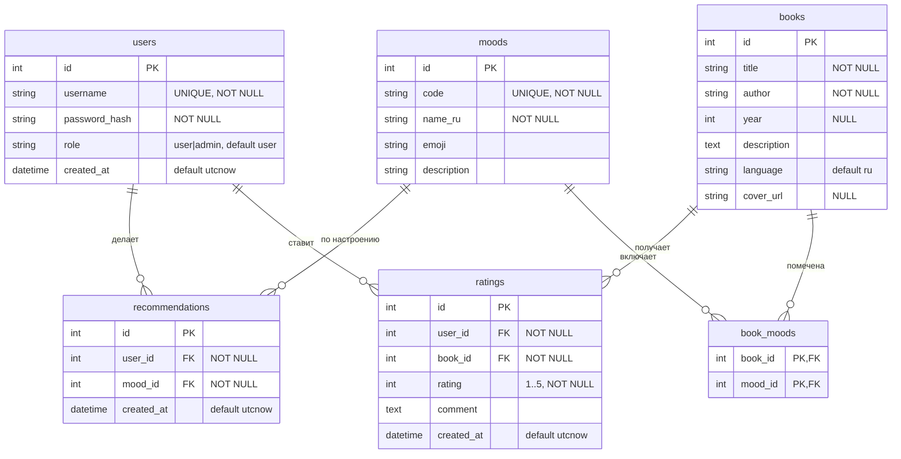
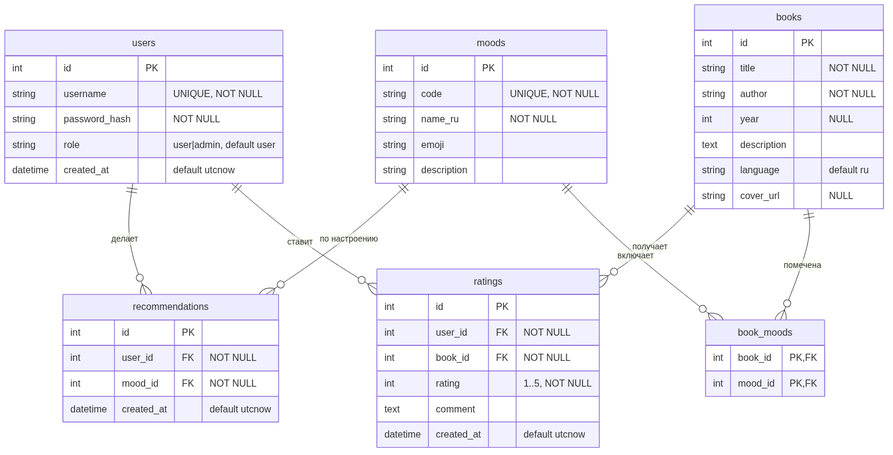

# ERD — диаграмма «сущность–связь»

Модель данных системы **«Книги по настроению»**. Источник истины — модели SQLAlchemy
в [models.py](../../models.py). База содержит **6 таблиц** (требование задания — не менее 5).

## Связи

| Связь | Тип | Внешний ключ | Поведение при удалении |
|---|---|---|---|
| `users` → `recommendations` | 1 : N | `recommendations.user_id` | `ON DELETE CASCADE` |
| `moods` → `recommendations` | 1 : N | `recommendations.mood_id` | `ON DELETE CASCADE` |
| `users` → `ratings` | 1 : N | `ratings.user_id` | `ON DELETE CASCADE` |
| `books` → `ratings` | 1 : N | `ratings.book_id` | `ON DELETE CASCADE` |
| `books` → `book_moods` | 1 : N | `book_moods.book_id` | `ON DELETE CASCADE` |
| `moods` → `book_moods` | 1 : N | `book_moods.mood_id` | `ON DELETE CASCADE` |

Связь «многие-ко-многим» `books` ↔ `moods` реализована через ассоциативную таблицу
`book_moods` (две связи 1:N выше), а не прямым ребром между `books` и `moods`.

## Ограничения целостности

- `users.username` — **UNIQUE**.
- `moods.code` — **UNIQUE**.
- `ratings (user_id, book_id)` — **UNIQUE** (`uq_user_book_rating`): один пользователь
  оценивает книгу не более одного раза (повторная отправка обновляет оценку).
- `book_moods (book_id, mood_id)` — составной первичный ключ (связь «многие-ко-многим»).
- Индексы: `ix_recommendations_user_id`, `ix_ratings_book_id`.

## Нормализация

Схема приведена к **третьей нормальной форме (3НФ)**:

- **1НФ** — все значения атомарны; связь «книга ↔ настроение» вынесена в отдельную
  таблицу `book_moods`, а не хранится списком в одном столбце.
- **2НФ** — у всех таблиц с данными одностолбцовый первичный ключ (`id`), частичных
  зависимостей нет; `book_moods` не содержит неключевых столбцов.
- **3НФ** — все неключевые столбцы зависят только от первичного ключа своей таблицы;
  транзитивных зависимостей нет.

Подробное описание каждого столбца — в [data-dictionary.md](data-dictionary.md).
