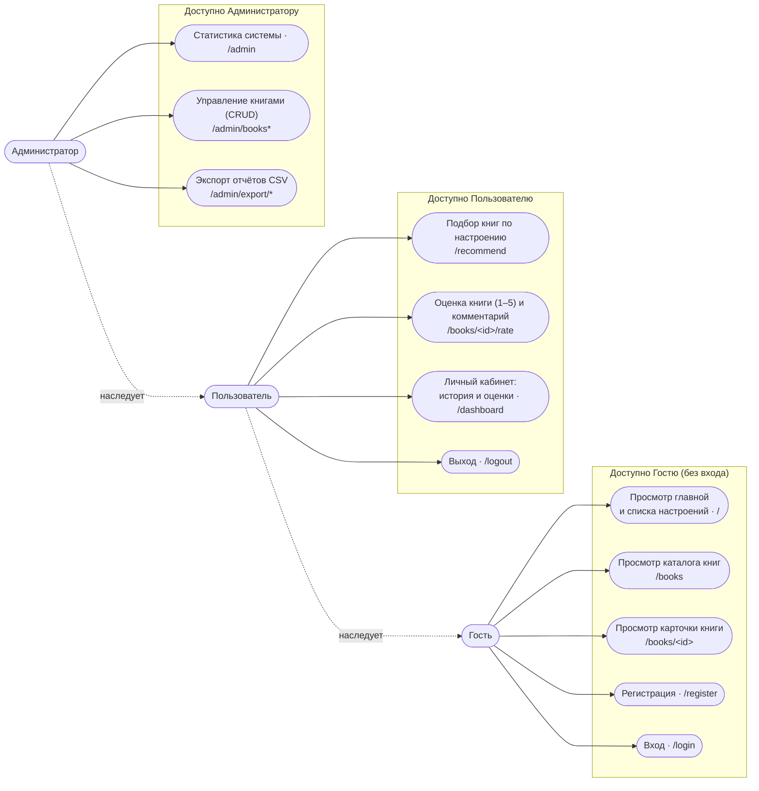

# UML — диаграмма вариантов использования (Use-Case)

Система: **«Книги по настроению»** (Flask-приложение, группа 152419).

Диаграмма отражает реальные маршруты приложения ([app.py](../../app.py)) и три роли.
Доступ к функциям задаётся декораторами: открытые маршруты — для всех, `@login_required`
— для зарегистрированных, `admin_required` — только для администратора.

## Акторы (роли)

- **Гость** — незарегистрированный посетитель. Доступ только на чтение.
- **Пользователь** — зарегистрированный пользователь (`role = "user"`). Наследует все
  возможности Гостя и добавляет персональные функции.
- **Администратор** — пользователь с `role = "admin"`. Наследует возможности
  Пользователя и добавляет управление каталогом и отчёты.

## Роли × функции

| Функция | Гость | Пользователь | Администратор |
|---|:---:|:---:|:---:|
| Главная, список настроений (`/`) | ✅ | ✅ | ✅ |
| Каталог книг, поиск и фильтр (`/books`) | ✅ | ✅ | ✅ |
| Карточка книги, чтение оценок (`/books/<id>`) | ✅ | ✅ | ✅ |
| Регистрация (`/register`) | ✅ | — | — |
| Вход (`/login`) | ✅ | — | — |
| Подбор 5 книг по настроению (`/recommend`) | — | ✅ | ✅ |
| Оценка книги и комментарий (`/books/<id>/rate`) | — | ✅ | ✅ |
| Личный кабинет: история рекомендаций и оценок (`/dashboard`) | — | ✅ | ✅ |
| Выход (`/logout`) | — | ✅ | ✅ |
| Статистика системы (`/admin`) | — | — | ✅ |
| Добавление / редактирование / удаление книг (`/admin/books*`) | — | — | ✅ |
| Экспорт CSV: книги и рекомендации (`/admin/export/*`) | — | — | ✅ |

**Примечания.**
- Гость работает **только на чтение**: он видит каталог и карточки книг, но при попытке
  подобрать книги по настроению перенаправляется на форму входа.
- Роли **иерархичны**: Пользователь умеет всё, что Гость, плюс персональные функции;
  Администратор умеет всё, что Пользователь, плюс администрирование.
- Требование задания «не менее 2 типов пользователей + незарегистрированный пользователь»
  выполнено: **Гость + Пользователь + Администратор**.
